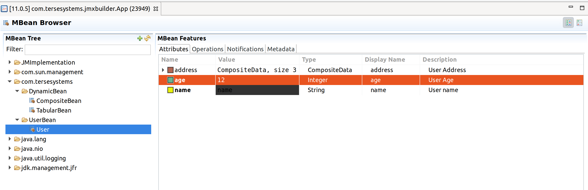

# JMXBuilder

<!---freshmark shields
output = [
	link(shield('Bintray', 'bintray', 'tersesystems:jmxbuilder', 'blue'), 'https://bintray.com/tersesystems/maven/jmxbuilder/view'),
	link(shield('Latest version', 'latest', '{{previousVersion}}', 'blue'), 'https://github.com/tersesystems/jmxbuilder/releases/latest'),
	link(shield('License Apache2', 'license', 'Apache2', 'blue'), 'https://www.tldrlegal.com/l/apache2'),
	'',
	link(image('Travis CI', 'https://travis-ci.org/tersesystems/jmxbuilder.svg?branch=master'), 'https://travis-ci.org/tersesystems/jmxbuilder')
	].join('\n')
-->
[](https://bintray.com/tersesystems/maven/jmxbuilder/view)
[](https://github.com/tersesystems/jmxbuilder/releases/latest)
[](https://www.tldrlegal.com/l/apache2)

[](https://travis-ci.org/tersesystems/jmxbuilder)
<!---freshmark /shields -->

JMXBuilder is a library that creates [Dynamic MBeans](https://docs.oracle.com/javase/8/docs/api/javax/management/DynamicMBean.html) from a set of attributes and operations, provided by functions.  

JMXBuilder is intended to help provide an admin interface for applications by exposing components in the most minimal way possible. 

JMXBuilder does not require you to understand the hairy internals of JMX.  It uses the [MXBean](https://docs.oracle.com/javase/8/docs/api/javax/management/MXBean.html) open type mappings, together with [CompositeData](https://docs.oracle.com/javase/8/docs/api/javax/management/openmbean/CompositeData.html) and [TabularData](https://docs.oracle.com/javase/8/docs/api/javax/management/openmbean/TabularData.html).  Roughly, the MXBean style exposes a "JSON style" for exposing information, where you keep things to strings, numbers, and booleans, and then composites are sub objects and tablular data are arrays.
 
If you are running on your laptop, then I like using [Zulu Mission Control](https://www.azul.com/products/zulu-mission-control/).

You should not use JMX Remoting, aka JSR-160, in production.  It uses Java serialization over RMI, which is fiddly to set up in production and exposes the server [Java Serialization attacks](https://tersesystems.com/2015/11/08/closing-the-open-door-of-java-object-serialization/).  JSR-160 is much slower than JSON over HTTPS.  It does not cover user authentication (TLS client authentication only covers the channel), or deal with fine grained authorization.  And it's also harder for non-Java based tools to integrate with.
 
If you want to use JMX remotely, you should use [Jolokia](https://jolokia.org/) as an agent to expose JMX over HTTP with the [appropriate authentication and authorization](https://jolokia.org/reference/html/security.html) and [Hawt.io](http://hawt.io/) to view it using an HTML GUI.  Making a [JAAS module](https://docs.oracle.com/javase/10/security/jaas-authorization-tutorial.htm#JSSEC-GUID-D43CF965-8A5F-4A23-A2AF-F41DD5F8B411) is pretty easy, and the Jolokia manual is comprehensive.

If you want to use JMX to pull out metrics from the JVM, then [JMXTrans](https://www.jmxtrans.org/) or the [Prometheus JMX Exporter](https://github.com/prometheus/jmx_exporter) may be a good fit.  Alternately, you can pull the information that the JVM exposes through the system mbeans through [Yammer Metrics JVM instrumentation](https://metrics.dropwizard.io/4.1.2/manual/jvm.html) and then send that through one of the reporters there.

If you are happy with Java annotations, I recommend [JMXWrapper](https://github.com/uklimaschewski/JMXWrapper) as a similar "no JMX manual required" solution.  JMXBuilder can also be used alongside JMXWrapper if that works better for you.

## Attributes

Let's start with a simple example where we want to create a user object and expose that through JMX.  The user will have a name, an age, and an address, but we'll only expose the name and age here.

Using JMXBuilder, we can provide that with the following code:

```java
class UserExample {
    static final MBeanServer mBeanServer = ManagementFactory.getPlatformMBeanServer();

    public static void registerUser() throws Exception {
        Address address = new Address("street1", "city", "state");
        final User user = new User("name", 12, address);

        final DynamicMBean userBean = DynamicBean.builder()
                .withSimpleAttribute(String.class, "name", user::getName, user::setName)
                .withSimpleAttribute(Integer.TYPE, "age", user::getAge, user::setAge)
                .build();

        ObjectName objectName = new ObjectName("com.tersesystems.jmxbuilder:type=UserBean,name=User");
        mBeanServer.registerMBean(userBean, objectName);
    }
}
```

This will provide something that looks like this:




> **NOTE**: JMXBuilder will attempt to infer the type when setting operations if it is not provided, but JMX has issues with primitive types.  Specify the type explicitly and use the `TYPE` field to be safe.

If you want to use javabeans, then you should use the `withBeanAttribute` property:

```java
public class DebugEnabledClass {
    private boolean debug;

    public boolean isDebugEnabled() {
        return debug;
    }

    public void setDebugEnabled(boolean debug) {
        this.debug = debug;
    }
}

DebugEnabledClass debugEnabledClass = new DebugEnabledClass();
final DynamicMBean serviceBean = DynamicBean.builder()
        .withBeanAttribute(Boolean.TYPE, "debugAttributeName", debugEnabledClass, "debugEnabled")
        .build();
```

## Composites

You can also specify composite data more generally and build up a mapping of data, exposing the user and the address by using a `CompositeDataWriter` to expose `User` and `Address` information in a nested "tree" interface.

```java
public class CompositeExample {

    static final CompositeDataWriter<Address> addressWriter = CompositeDataWriter.builder(Address.class)
            .withTypeName("address")
            .withTypeDescription("Address")
            .withSimpleAttribute(String.class, "street1", "Street 1", Address::getStreet1)
            .withSimpleAttribute("city", Address::getCity)
            .withSimpleAttribute("state", Address::getState)
            .build();

    static final CompositeDataWriter<User> userWriter = CompositeDataWriter.builder(User.class)
            .withTypeName("user")
            .withTypeDescription("User")
            .withSimpleAttribute("name", User::getName)
            .withSimpleAttribute("age", User::getAge)
            .withCompositeAttribute("address", user -> user.getAddress(), addressWriter).build();

    public static void compositeBean() throws Exception {
        final Address address = new Address("street1", "city", "state");
        final User user = new User("name", 12, address);
        final DynamicMBean userBean = DynamicBean.builder()
                .withCompositeAttribute("User", () -> user, userWriter)
                .build();

        ObjectName objectName = new ObjectName("com.tersesystems:type=DynamicBean,name=CompositeBean");
        mBeanServer.registerMBean(userBean, objectName);

        final CompositeData userItem = (CompositeData) mBeanServer.getAttribute(objectName, "User");
        printUser(userItem);
    }

}
```


## Tables

We can also do lists of users, using the same writers we defined earlier and mapping them to an `Iterable<User>`, using the `TabularDataWriter`:

```java
public class TabularExample {
    // ... composite writers as above

    static final TabularDataWriter<User> usersWriter = TabularDataWriter.builder(User.class)
            .withTypeName("users")
            .withTypeDescription("Users")
            .withIndexName("name")
            .withCompositeDataWriter(userWriter)
            .build();

    public static void tabularBean() throws Exception {
        final Address address = new Address("street1", "city", "state");
        final List<User> usersList = Collections.singletonList(new User("name", 12, address));

        final DynamicMBean usersBean = DynamicBean.builder()
                .withTabularAttribute("Users", () -> usersList, usersWriter)
                .build();

        ObjectName objectName = new ObjectName("com.tersesystems:type=DynamicBean,name=TabularBean");
        mBeanServer.registerMBean(usersBean, objectName);

        final TabularData users = (TabularData) mBeanServer.getAttribute(objectName, "Users");
        for (Object row : users.values()) {
            printUser((CompositeData) row);
        }
    }
}
```

Which looks like this:


## Operations

You can also provide [operations](https://docs.oracle.com/javase/8/docs/api/javax/management/MBeanOperationInfo.html) to a builder, which is useful for services.  You can specify by passing in the function:

```java
class ExampleService {
    private boolean debug;

    String dump() {
        return ("Dumping contents");
    }
}

public class DumpExample {
    public void exposeDump(Service service) {
        static final MBeanServer mBeanServer = ManagementFactory.getPlatformMBeanServer();
        final DynamicMBean serviceBean = DynamicBean.builder()
                .withOperation("dump", service::dump)
                .build();
        // ...
    }
}
```

Or you can use reflection and just pass in the object you want the operation called on.

```java
public class DebugExample {
    public void exposeDebugOperations(Service service) {
        ParameterInfo paramInfo = ...;
        final DynamicMBean debugBean = DynamicBean.builder()
                .withOperation("turnOnDebugForMinutes", service, "timedDebug", paramInfo)
                .build();
        // ...
    }   

}
```

## Some Caveats

JMX does not have great performance or resolution, so you should not use this to render 100K of data or poll for data repeatedly.

The platform MBeanServer is tied to the lifecycle of the JVM itself.  If you are running applications with a different lifecycle, i.e. a Java EE app that may reload its classloader, then you are responsible for unregistering the MBean in an application shutdown hook.

JMX does not have any knowledge of thread safety, and doesn't provide any kind of protection for multiple clients calling operations concurrently.  

Again, do not use JMX-160 aka Java Remoting, as it is slow, fiddly, and [insecure](https://tersesystems.com/2015/11/08/closing-the-open-door-of-java-object-serialization/).

## Internals

Internally, the DynamicBean builder assembles a DynamicBean, using Open MBean type data in much the same way as an [MXBean](https://docs.oracle.com/javase/8/docs/api/javax/management/MXBean.html).   This is the same approach taken by [JMXWrapper.java](https://github.com/uklimaschewski/JMXWrapper/blob/master/src/com/udojava/jmx/wrapper/JMXBeanWrapper.java).

The DynamicBean consists of attributes, operations, and notifications which are put together from Info objects.  Each of these has their own builder APIs, i.e. `AttributeInfo` is created from `AttributeInfo.builder()`.  This allows for filling out details like the description and the descriptor, which aren't available from the default API.

OpenMBean API has some issues, because it doesn't handle primitive types like `int` or `boolean`.  To correct this, the `MBeanInfo` returned is not an `OpenMBeanInfo` and there is some special case handling..  From the [MBeanInfo contents for an MXBean section](https://docs.oracle.com/javase/8/docs/api/javax/management/MXBean.html): 

> An MXBean is a type of Open MBean. However, for compatibility reasons, its MBeanInfo is not an OpenMBeanInfo. In particular, when the type of an attribute, parameter, or operation return value is a primitive type such as int, or is void (for a return type), then the attribute, parameter, or operation will be represented respectively by an MBeanAttributeInfo, MBeanParameterInfo, or MBeanOperationInfo whose getType() or getReturnType() returns the primitive name ("int" etc). This is so even though the mapping rules above specify that the opendata mapping is the wrapped type (Integer etc).
.
>
> The Descriptor for all of the MBeanAttributeInfo, MBeanParameterInfo, and MBeanOperationInfo objects contained in the MBeanInfo will have a field openType whose value is the OpenType specified by the mapping rules above. So even when getType() is "int", getDescriptor().getField("openType") will be SimpleType.INTEGER.
> 
> The Descriptor for each of these objects will also have a field originalType that is a string representing the Java type that appeared in the MXBean interface. The format of this string is described in the section Type Names below.
>
> The Descriptor for the MBeanInfo will have a field mxbean whose value is the string "true".


