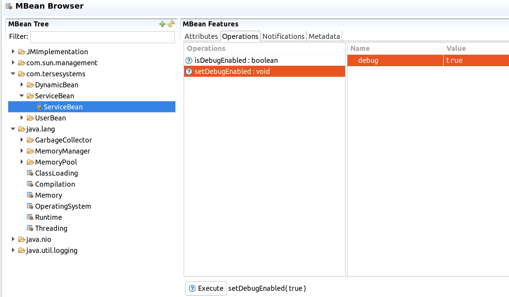

# JMXBuilder

[](https://travis-ci.org/tersesystems/jmxbuilder)

JMXBuilder is a library that creates [Dynamic MBeans](https://docs.oracle.com/javase/8/docs/api/javax/management/DynamicMBean.html) from a set of attributes and operations, provided by functions.  

JMXBuilder is intended to help provide an admin interface for applications by exposing components in the most minimal way possible. 

JMXBuilder does not require you to understand the hairy internals of JMX.  It uses the [MXBean](https://docs.oracle.com/javase/8/docs/api/javax/management/MXBean.html) open type mappings, together with [CompositeData](https://docs.oracle.com/javase/8/docs/api/javax/management/openmbean/CompositeData.html) and [TabularData](https://docs.oracle.com/javase/8/docs/api/javax/management/openmbean/TabularData.html).  Roughly, the MXBean style exposes a "JSON style" for exposing information, where you keep things to strings, numbers, and booleans, and then composites are sub objects and tablular data are arrays.
 
## Attributes

Let's start with a simple example where we want to create a user object and expose that through JMX.  The user will have a name, an age, and an address, but we'll only expose the name and age here.

Using JMXBuilder, we can provide that with the following code:

```java
class UserExample {
    static final MBeanServer mBeanServer = ManagementFactory.getPlatformMBeanServer();

    public static void registerUser() throws Exception {
        Address address = new Address("street1", "city", "state");
        final User user = new User("name", 12, address);

        final DynamicMBean userBean = new DynamicBeanBuilder()
                .withSimpleAttribute("name", "User name", user::getName, user::setName)
                .withSimpleAttribute("age", "User Age", user::getAge, user::setAge, new DescriptorBuilder().withUnits("years").build())
                .withDescriptor(new DescriptorBuilder().withImmutableInfo(false).build())
                .build();

        ObjectName objectName = new ObjectName("com.tersesystems.jmxbuilder:type=UserBean,name=User");
        mBeanServer.registerMBean(userBean, objectName);
    }
}
```

This will provide something that looks like this:


## Composites

You can also specify composite data more generally and build up a mapping of data, exposing the user and the address by using a `CompositeDataWriter` to expose `User` and `Address` information in a nested "tree" interface.

```java
public class CompositeExample {

    static class CompositeItemBean<T> {
        private final CompositeDataWriter<T> compositeBuilder;
        private final Supplier<T> itemSupplier;

        public CompositeItemBean(CompositeDataWriter<T> compositeBuilder, Supplier<T> itemSupplier) {
            this.itemSupplier = itemSupplier;
            this.compositeBuilder = compositeBuilder;
        }

        public CompositeData getItem() {
            return compositeBuilder.apply(itemSupplier.get());
        }
    }

    static final CompositeDataWriter<Address> addressWriter = CompositeDataWriter.<Address>builder()
            .withTypeName("address")
            .withTypeDescription("Address")
            .withSimpleAttribute("street1", "Street 1", Address::getStreet1)
            .withSimpleAttribute("city", "City", Address::getCity)
            .withSimpleAttribute("state", "State", Address::getState)
            .build();

    static final CompositeDataWriter<User> userWriter = CompositeDataWriter.<User>builder()
        .withTypeName("user")
        .withTypeDescription("User")
        .withSimpleAttribute("name", "Name", User::getName)
        .withSimpleAttribute("age", "Age", User::getAge)
        .withCompositeAttribute("address", "Address", User::getAddress, addressWriter).build();

    public static void compositeBean() throws Exception {
        final Address address = new Address("street1", "city", "state");
        final User user = new User("name", 12, address);
        final CompositeItemBean<User> compositeItemBean = new CompositeItemBean<>(userWriter, () -> user);

        final DynamicMBean userBean = new DynamicBean.Builder()
                .withSimpleAttribute("User", "User", compositeItemBean::getItem)
                .build();

        ObjectName objectName = new ObjectName("com.tersesystems:type=DynamicBean,name=CompositeBean");
        mBeanServer.registerMBean(userBean, objectName);

        final CompositeData userItem = (CompositeData) mBeanServer.getAttribute(objectName, "User");
        printUser(userItem);
    }
}
```


## Tables

We can also do lists of users, using the same writers we defined earlier and mapping them to an `Iterable<User>`, using the `TabularDataWriter`:

```java
public class TabularExample {
    static class TabularItemBean<T> {
        private final Supplier<Iterable<T>> itemsSupplier;
        private final TabularDataWriter<T> builder;

        public TabularItemBean(TabularDataWriter<T> builder, Supplier<Iterable<T>> items) {
            this.builder = builder;
            this.itemsSupplier = items;
        }

        public TabularData getItem() {
            return builder.apply(itemsSupplier.get());
        }
    }

    public static void tabularBean() throws Exception {
        final Address address = new Address("street1", "city", "state");
        final List<User> usersList = Collections.singletonList(new User("name", 12, address));

        TabularItemBean<User> tabularItemBean = new TabularItemBean<>(usersWriter, () -> usersList);
        final DynamicMBean usersBean = new DynamicBean.Builder()
                .withSimpleAttribute("Users", "Users Table", tabularItemBean::getItem)
                .build();

        ObjectName objectName = new ObjectName("com.tersesystems:type=DynamicBean,name=TabularBean");
        mBeanServer.registerMBean(usersBean, objectName);

        final TabularData users = (TabularData) mBeanServer.getAttribute(objectName, "Users");
        for (Object row : users.values()) {
            printUser((CompositeData) row);
        }
    }
}
```

Which looks like this:


## Operations

You can also provide [operations]() to a builder, which is useful for services.  You can specify by passing in the function:

```java
class ExampleService {
    private boolean debug;

    String dump() {
        return ("Dumping contents");
    }

    public boolean isDebugEnabled() {
        return debug;
    }

    public void setDebugEnabled(boolean debug) {
        this.debug = debug;
    }
}

public class DumpExample {
    public void exposeDump(Service service) {
        static final MBeanServer mBeanServer = ManagementFactory.getPlatformMBeanServer();
        final DynamicMBean serviceBean = DynamicBean.builder()
                .withOperation("dump", "dumps the internal state", service::dump)
                .build();
        // ...
    }
}
```

Or you can use reflection and just pass in the object you want the operation called on.

```java
public class DebugExample {
    public void exposeDebugMethods(Service service) {
        final DynamicMBean debugBean = new DynamicBean.Builder()
                .withOperation("isDebugEnabled", "returns true if is debugging", service)
                .withOperation("setDebugEnabled", "sets debugging", service,
                        ParameterInfo.builder(Boolean.TYPE).withName("debug").build())
                .build();
        // ...
    }   

}
```

which looks like this:



## Notification

[JMX Notification](https://docs.oracle.com/javase/tutorial/jmx/notifs/index.html) is not a very well supported feature, and I recommend you use something else rather than implementing it.  JMXBuilder does have full support for it though.

## Some Caveats

JMX does not have great performance or resolution, so you should not use this to be your main query interface.

The platform MBeanServer is tied to the lifecycle of the JVM itself.  If you are running applications with a different lifecycle, i.e. a Java EE app that may reload its classloader, then you are responsible for unregistering the MBean in an application shutdown hook.

JMX does not have any knowledge of thread safety, and doesn't provide any kind of protection for multiple clients calling operations concurrently.  

**[DO NOT USE JMX REMOTING IN PRODUCTION](https://tersesystems.com/2015/11/08/closing-the-open-door-of-java-object-serialization/).**

## Further Reading

If you are happy with Java annotations, I recommend [JMXWrapper](https://github.com/uklimaschewski/JMXWrapper) as a similar "no JMX manual required" solution.  JMXBuilder can also be used alongside JMXWrapper if that works better for you.

If you want to use JMX for management, you should use [Jolokia](https://jolokia.org/) as an agent to expose JMX over HTTP with the [appropriate authentication and authorization](https://jolokia.org/reference/html/security.html) and [Hawt.io](http://hawt.io/) to view it using an HTML GUI.  Don't worry, making a [JAAS module](https://docs.oracle.com/javase/10/security/jaas-authorization-tutorial.htm#JSSEC-GUID-D43CF965-8A5F-4A23-A2AF-F41DD5F8B411) isn't that hard.

If you really want to know how JMX works, the [specification](https://docs.oracle.com/javase/8/docs/technotes/guides/jmx/JMX_1_4_specification.pdf) is still the best available tool.  If you want the gory details, then Dustin Marx has the [definitive series](https://marxsoftware.blogspot.com/search/label/JMX) of blog posts going into detail of the JMX implementation.  The [JMX Accelerated HOWTO](http://docs.huihoo.com/howto/jmx/jmx.html) is also good.  Frankly, I recommend not reading any of this, as most of it is very dated and not needed as an end user.


